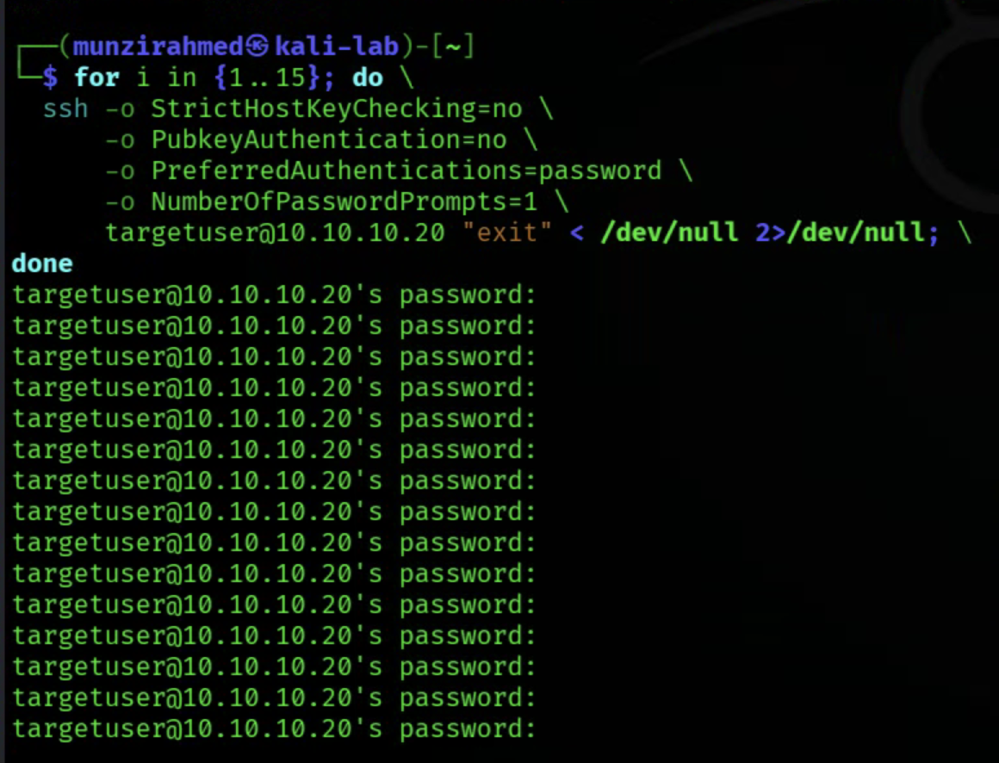
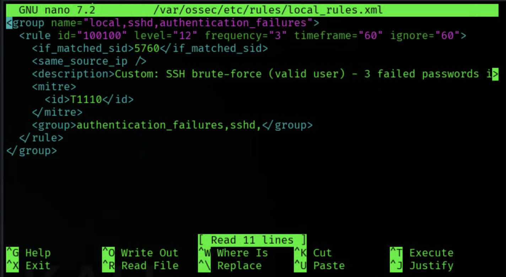
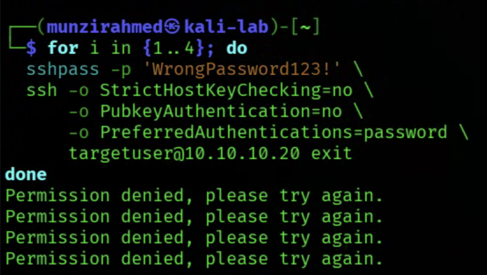
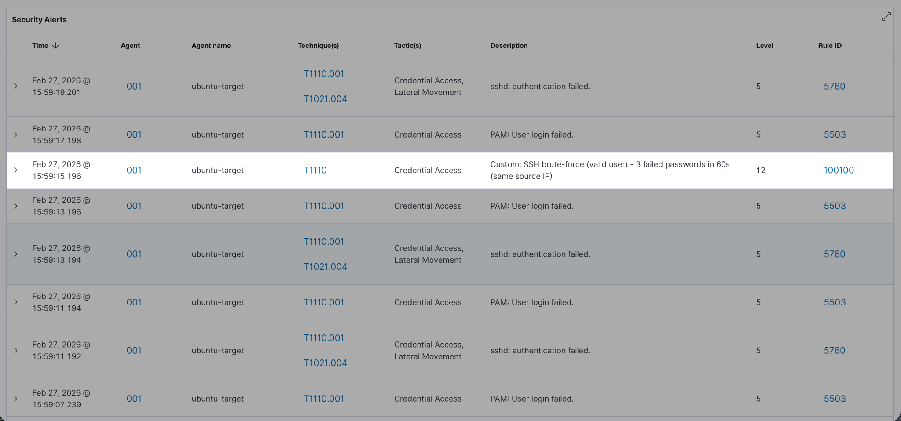
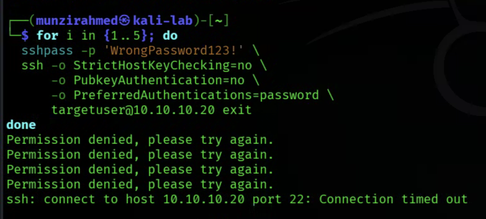
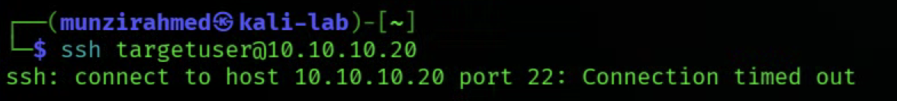

# Automated-SSH-Brute-Force-Detection-and-Response-Pipeline-with-Wazuh

## Overview

This project builds a complete detection and response pipeline for SSH brute force attacks using Wazuh.

The objective was to move beyond simply generating alerts and instead engineer a defensive workflow that:

• Detects repeated SSH authentication failures  
• Escalates suspicious behaviour using correlation rules  
• Triggers automated containment on the target system  
• Restores access automatically after a timeout  

The lab was built in a fully isolated environment where attack activity could be generated safely and analysed step by step.

---

## Lab Environment

The lab was built using **Proxmox** with three virtual machines connected through an isolated internal network.

**Internal Network**

```
10.10.10.0/24
```

**Virtual Machines**

| Machine | Role | IP |
|------|------|------|
| Kali Linux | Attacker | 10.10.10.10 |
| Ubuntu Target | Monitored endpoint | 10.10.10.20 |
| Ubuntu SIEM | Wazuh manager + dashboard | 10.10.10.30 |

The Wazuh manager also had a **second interface** so the dashboard could be accessed from my laptop without exposing the attack network.

```
192.168.68.118
```

---

## Tools Used

• Proxmox  
• Kali Linux  
• Ubuntu Server  
• Wazuh SIEM  
• SSH  
• Linux authentication logs  
• UFW firewall  

---

# Part 1 — Infrastructure and SIEM Deployment

The first stage was building the monitoring infrastructure.

### Environment Setup

• Created an isolated network in Proxmox  
• Deployed three virtual machines  
• Assigned static IP addresses  
• Configured network segmentation  

### Wazuh Deployment

Wazuh was installed on the **Ubuntu SIEM machine** as both:

• Manager  
• Dashboard  

This allowed the system to:

• Collect logs  
• Apply detection rules  
• Visualise alerts through the web interface  

### Agent Configuration

The Ubuntu target machine was configured as a **Wazuh agent**.

Steps included:

• Installing the Wazuh agent  
• Registering the agent with the manager  
• Verifying connectivity  
• Confirming logs were being ingested

The main log source used for the project was:

```
/var/log/auth.log
```

At the end of this stage the SIEM environment was successfully ingesting authentication logs from the target machine.

---

# Part 2 — SSH Brute Force Detection and Rule Analysis

With the infrastructure working, the next step was to simulate an attack.

### Attack Simulation

From the Kali machine I generated repeated SSH login attempts against the Ubuntu target.



Each failed login attempt produced entries in the authentication log which were collected by the Wazuh agent.

### Default Detection Behaviour

Initially Wazuh generated alerts for each failed authentication attempt.

These alerts were tied to default rules for:

• SSH authentication failure  
• Invalid user login attempts  

After repeated failures within a short timeframe, Wazuh escalated the event.

### Correlation Behaviour

After **8 failed login attempts**, Wazuh triggered a brute force detection rule.

This demonstrated how Wazuh correlates events rather than treating them independently.

The generated alert contained structured information including:

```
Source IP
Destination user
Source port
Frequency of attempts
Previous log entries
```

Example alert fields:

```
"srcip": "10.10.10.10"
"dstuser": "targetuser"
"frequency": 8
"level": 10
```

### MITRE ATT&CK Mapping

The alert was also mapped to:

```
T1110 — Brute Force
```

Tactic:

```
Credential Access
```

This demonstrates how Wazuh aligns detection with recognised attack frameworks.

---

# Part 3 — Custom Escalation Logic

After validating the default rules, I implemented a **custom detection rule** to control when escalation occurs.

### Custom Rule

Rule ID:

```
100100
```

The rule was configured to trigger when:

• **3 failed SSH login attempts** occur  
• From the **same source IP**  
• Within a defined timeframe  

When this threshold was reached the rule generated a:

```
Level 12 alert
```

This allowed earlier detection of suspicious behaviour.

### Rule Logic

The rule was chained using:

```
if_matched_sid
```

This ensured that the rule only triggered **after the original SSH authentication failure rule matched**.

This approach preserved proper event correlation rather than generating isolated alerts.



### Validation

Repeated SSH login attempts were generated from Kali.




Results:

• After the third failed login  
• A **level 12 alert appeared in the Wazuh dashboard**

This confirmed the custom detection logic was functioning correctly.

### Troubleshooting

During this phase several configuration issues occurred.

Problems included:

• XML formatting errors  
• Incorrect tag placement  
• Wazuh manager failing to restart

To resolve this I:

• Reviewed the configuration structure  
• Corrected misplaced XML tags  
• Validated the configuration before restarting the manager

This troubleshooting reinforced how precise SIEM configuration must be.

---

# Part 4 — Automated Containment with Active Response

The final stage introduced **automated response**.

The objective was to block the attacker automatically once the custom rule triggered.

### Active Response Configuration

The Wazuh **firewall-drop** command was configured.

```
<command>
  <name>firewall-drop</name>
  <executable>firewall-drop</executable>
  <expect>srcip</expect>
  <timeout_allowed>yes</timeout_allowed>
</command>
```

The response was then linked to the custom rule.

```
<active-response>
  <command>firewall-drop</command>
  <location>defined-agent</location>
  <agent_id>001</agent_id>
  <rules_id>100100</rules_id>
  <timeout>600</timeout>
</active-response>
```


### Behaviour

Once rule **100100** fired:

1. Wazuh passed the attacker IP to the firewall script  
2. The firewall inserted a DROP rule  
3. SSH connections from the attacker failed  

Verification steps included:

• Checking the `active-responses.log`  
• Confirming the attacker IP was blocked  
• Attempting to SSH again from Kali

The SSH connection **hung and timed out**, confirming the block worked.



### Timeout

A timeout of **600 seconds** was configured.

After the timeout expired:

• The firewall rule was automatically removed  
• SSH connectivity was restored

---

# Key Takeaways

This project demonstrates a full defensive workflow:

1. Infrastructure deployment  
2. Attack detection  
3. Custom rule engineering  
4. Automated containment  

Skills developed during the lab:

• SIEM deployment  
• Log ingestion and analysis  
• Detection rule engineering  
• Event correlation  
• Automated incident response  
• Troubleshooting SIEM configurations  

---

# Project Outcome

The final system successfully:

• Detects repeated SSH login attempts  
• Escalates them using a custom rule  
• Automatically blocks the attacker IP  
• Restores access after a timeout  

This project moved beyond simply viewing alerts and instead focused on **engineering a defensive detection and response pipeline similar to what would be implemented in a real SOC environment.**
